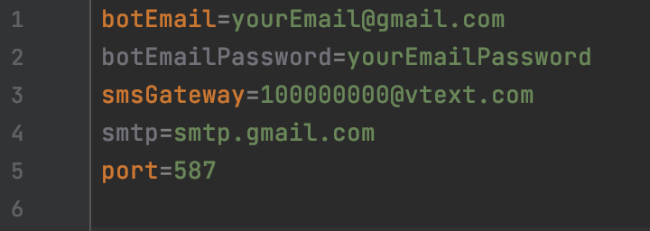

# CryptoNotificationBot

CryptoNotificationBot is a notification service that sends SMS push notifications to your
mobile device when a specified low or high cryptocurrency share price is reached.

## Before Running

Follow this link to install python 3.x:  
https://www.python.org/downloads/release/python-391/

Since this bot sends SMS notifications, we will need to give the bot the SMS gateway for your phone and an email to send
messages from. 

Make a copy of the bot-default-properties file called bot-properties.
Open the bot-properties file in a text editor. It should look like this:

* Fill in the botEmail and botEmailPassword fields with the email and password you want to send messages from.
* Fill in the smsGateway field with the smsGateway appropriate for your mobile device. 
  SMS Gateways can be found [here](https://dev.to/mraza007/sending-sms-using-python-jkd).
* Change the smtp field to the appropriate smtp server for your email.  

~~~
# This module retrieves data from the Gemini cryptocurrency API.
import requests, json

# This module implements the SMS feature. 
import smtplib 

# This module allows notifications to be scheduled.
import time 
~~~

## Running the Bot

In order to run the bot, type this into the terminal:
~~~
python3 cryptoBot.py
~~~

When running, the terminal should look like this: 

The statements output in the terminal are the same as the ones that should be sent to your
mobile device.

## Resources

If you would like to take a look at the details of this bot and build upon it, here are some resources to check out:

* [Gemini](https://docs.gemini.com/rest-api/), the cryptocurrency API used by the bot
* [Sending SMS using Python](https://dev.to/mraza007/sending-sms-using-python-jkd)